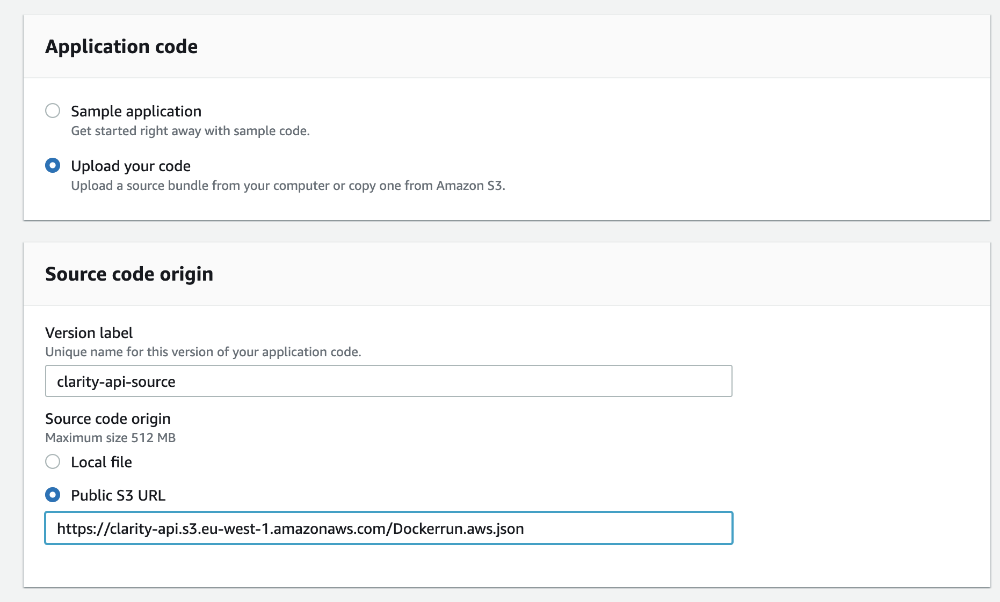
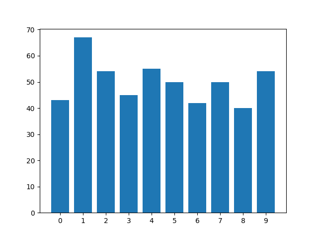

# ClarityMLE
Clarity AI Machine Learning Engineering Test

## Purpose 
* How you take the business context into account
* What approaches did you consider and why did you choose the final one in particular
* Technical proficiency and best practices
* What you would do differently if you had more time

## The Task
One of the data scientists in the team hands you a model in the form of a notebook and asks you to deploy it in production. It is a model that can recognise handwritten digits.

Example use case: 
* Postal service looking to recognise numerical postal codes
* Online prediction, with up to 100 requests per second
* Must have latency of less the couple of seconds
* Could be a variable load, e.g. multiple postal trucks arriving at once
* No existing baseline model in production 
* Assume the given model is the best model developed 

Utilise machine learning and engineering skills to design a suitable architecture and develop deployable code to run model training and inference. Part, if not all, of your solution, should be written in Python, as this is the language in which the model has been developed. Your design should take into consideration how the model will be used in practice.
### Service Level Objectives (SLOs)

- [X] 99.99% uptime - only tested over 24 hours (no downtime).
- [X] 500 predictions within 4s (tested in unit_test.py with 5 asynchronous calls of 100 images).
- [X] > 95% accuracy on unseen test images.
- [X] Dashboard to show the relevant engineering metrics and model observability (AWS CloudWatch).

## Plan

- [X] Create inference API using FastAPI. (alternatives such as Flask, TensorFlow and PyTorch Serving could achieve a similar effect). Why an API? By creating a standalone inference microservice, the model can be integrated with several apps which can call the API a black box, rather than worry about what is going on under the hood. 
- [X] Containerisation - Docker container for the prediction API.
- [X] Batching online prediction for performance. Can batch list inputs, currently no batch endpoint for raw image files. 
- [X] Cloud deployment - AWS for deployment using Elastic Beanstalk with EC2 instances. In future could test hardware acceleration such as GPUs and AWS Inferentia. With more time, we would set up a data streaming solution (AWS Kinesis or Apache Kafka) and a real-time analytics service (Apache Flink) to manage the auto-scaling in response to traffic patterns. "Serverless" solutions such as AWS Lambda were considered but given the business context would expect some consistent level of traffic, it was deemed unsuitable. Kubernetes-based solutions were also considered, using EKS/ECS, but due to the smaller scale and cost considerations of the project, these were not pursued. 
- [X] Auto scaling and load balancing - Our Elastic Beanstalk service creates an Auto Scaling Group and Elastic Load Balancer to route traffic to the EC2 instances running our endpoints. 
- [X] Application Monitoring - metrics, logs, tracing (API latency, log errors, service health metrics).
- [X] Model Observability - prediction distribution (compared to training distribution), data quality. A model card with the key model metrics and details can be seen in the docs directory.  
- [X] IaC - As far as possible follow engineering best practices by defining infrastructure as code. Define bash scripts to build and push Docker Images, Deploy Infrastructure using Elastic Beanstalk script. Create automated unit tests using pytest that tests if the endpoint achieves the objectives and how it behaves with unexpected inputs. Ideally, we would automate to ensure these tests are run on any new endpoint before it replaces an existing production version.

## Considerations out of scope

* **Test in production** - Shadow Testing, A/B Testing, Canary Release, Bandits. If we had existing models in production, we would want to test our new model to understand how it compares to the existing production models. For example by gradually routing more traffic to the model if production evaluation shows it is outperforming the other models (A/B testing).
 
* **Pre-production stages of ML lifecycle** - Data Engineering, Training Data, Feature Engineering, Model Development and Testing.

* **Model compression** - consider Quantisation of model, e.g. using half-precision (16-bit) or fixed-point (8-bit ints) to represent model parameters. This should reduce computation and memory footprint, but may drop accuracy too much. 

* **Continual learning** - in a production system we would store new incoming data in a datalake, alongside logs, predictions, and application data, which we could use for further training.

* **Human-in-the-loop feedback** - For low probability predictions, we may want to include human feedback/labels. Interesting video on the topic of how poorly written addresses are handled [here](https://www.youtube.com/watch?v=XxCha4Kez9c). We may also want to include a group of human labellers to further create a larger, more diverse, training set for future model improvements.  

* **Batch features** - The only features for this app come streaming from the request. More complex model applications may use a combination of streaming and batch features. Batch features may be stored in data warehouses, for example, we may store the median food preparation time for a restaurant when predicting the estimated delivery time for a food delivery app. 

* **Edge Serving** - to decrease latency we may deploy the model on an edge device to the postal sorting office, which will decrease the time taken to transfer data to an off-prem cloud server. New models could be trained offline and stored in the model registry, and periodically pushed to edge devices. Edge serving comes with benefits in latency, efficient network usage, privacy and security, and reliability. But they may have less compute/memory for larger models, so quantization may be key for success.

* **Data Distributional Shifts** - the training data has a roughly equal class distribution, but this may not be the same as the class distribution in production, e.g. we may expect far may 0s than 9s. Further, the input format of the training images is very consistent, e.g. white digits on a clean black background vertically aligned at a 28 x 28 scale. In real life the images may on a different scale, coloured, or not vertically aligned. This requires processing the image into the correct format which may look quite different to the training data. The difference could be as simple as having white writing on a dark background, something not encountered in training, but we would expect significantly worse performance if this were the case.  

* **Data Monitoring** - linking to the above, we want to automate input data monitoring for features like freshness, volume, distribution, and model fairness.

* **Explainability** - Given the nature of the task (predicting zip codes), prediction explainability is not a major concern. We could evaluate the model using [SHAP](https://github.com/slundberg/shap) to understand which pixels are most important to a model's prediction. 

* **Business Impact Metrics** - The (assumed) end goal of the project is to reduce the overall cost and time taken to deliver the post. This sub-project of classifying digits of zip codes, presumably at a sorting office, should therefore aim to sort posts quickly. Accuracy is vital as the misdirected post could drastically increase the expected delivery time and associated costs. To validate the benefit we must compare this process to the baseline (e.g. human sorting). If any accuracy is lost in changing to the ML model, we must factor in the time and cost to correct mistakes in our evaluation.  

## Setup

If you would like to run the code in this repository firstly you need to create a new environment with Python version 3.9 and install the necessary dependencies. If using Conda to manage your environment this can be achieved using the below commands from the root of the repo:
```bash
conda create -n <env_name> python=3.9 
conda activate <env_name>
pip install -r requirements.txt
```

To deploy to AWS with the instructions here, please make sure you have an AWS account and have the AWS CLI installed (instructions [here](https://docs.aws.amazon.com/cli/latest/userguide/getting-started-prereqs.html)). Then ensure your default credentials are configured, by running:

```bash 
aws configure
``` 

Or directly accessing your '.aws/credentials' file and providing the following details:

```bash
[default]
aws_access_key_id = <YOUR_AWS_ACCESS_KEY_ID>
aws_secret_access_key = <YOUR_SECRET_ACCESS_KEY>
region = <DEFAULT-REGION>
```

You will also need a Docker installed on your decive (instructions [here](https://docs.docker.com/get-docker/)).

## Containerise with Docker

If you would like to containerise the application to run locally run the below from the root directory:

```bash
docker build -t <image_name> .
docker run -p 8080:8080 -d <image_name>
```

Then visit http://0.0.0.0:8080/docs to see the interactive Swagger UI for the prediction API. The Swagger UI contains the API documentation, including expected inputs, outputs, and error messages.

Here you can test the prediction by linking to your own images. For example using the URL [here](https://camo.githubusercontent.com/3d9666a8f0c5658667292b74ca19295827c2b22a0e903db283998ae213e6f6e1/68747470733a2f2f646174616d61646e6573732e6769746875622e696f2f6173736574732f696d616765732f74665f66696c655f666565642f4d4e4953545f64696769742e706e67).

A library of MNIST .jpg images can be found on [Kaggle](https://www.kaggle.com/datasets/scolianni/mnistasjpg).

## Deploy to AWS

To deploy our API to make it available to the client, first push the container to AWS [Elastic Container Registry](https://aws.amazon.com/ecr/) (ECR). To do this we have added a bash script to build the docker image and push it to your default AWS account. This will create a repository called 'clarity-api'. To run the script run the below command from the root directory:

```bash
sh aws/build_push.sh
```

When we make changes to our source repo, we can run this script again to push the latest version of our app to the registry. With a CloudFormation or Terraform script, we could automatically redeploy our infrastructure with the latest version. This is a key component of the standard CI/CD pipeline. Ideally, given more time, we would implement more complete unit tests and model performance-based testing which would need to be passed before any existing app was updated with the latest version. 

To provision the infrastructure using AWS Elastic Beanstalk, first, create an S3 bucket to upload the Dockerrun.aws.json file (you may also need to edit this file with your appropriate image URI). You can do this using the AWS CLI using the below command from the AWS directory (replacing <your_s3_bucket_name> with desired bucket name):

```bash
aws s3 mb "s3://<your_s3_bucket_name>"
aws s3 cp "Dockerrun.aws.json" "s3://<your_s3_bucket_name>/Dockerrun.aws.json"
```

Now go to AWS Elastic Beanstalk console and create an app using the Docker Platform and a source code origin pointing to the S3 bucket created, e.g. 



Then click "Create Environment" and wait a few minutes for the infrastructure to setup. Once completed you should now be able call the img or batch prediction endpoint by following the link provided, for example: "http://clarityapi-env-1.eba-289rmxee.eu-west-1.elasticbeanstalk.com/predict/batch". The batch prediction has a limit of around 100 predictions per call due to the data transfer limit. 

## Testing

To assess the production endpoint we have created a set of tests for the endpoint. Machine learning tests can be broadly categorised into the below subcategories:

* Functional Testing - assert expected output for given inputs.
* Statistical Testing - test the API on unseen requests, and check online prediction distribution against training prediction distribution.
* Error handling - ensure the API handle bad inputs and produces helpful error messages. 
* Load testing - test API with x inputs over y seconds to ensure is scales appropriately and has optimal CPU/GPU utilisation. 
* End-to-end - validate all subsystems are working as expected. 

We can perform basic API testing using the api_test.py script in the test directory. This script can either be used with a local Docker conainter running or testing the hosted endpoint by setting the "--local" flag to True for local testing or False for testing the hosted endpoint. To test locally whilst running the docker container on port 8080, from the root directory run:

```bash
cd tests
python3 api_test.py -n 100
```

This will call the API with a batch of 100 test set examples, the expected return will look something like the below:

```
Time: 1.4840s
Accuracy: 99.60%
Prediction distribution: OrderedDict([(0, 43), (1, 67), (2, 54), (3, 45), (4, 55), (5, 50), (6, 42), (7, 50), (8, 40), (9, 54)])
```

Using the -p True flag we can also return a plot of the prediction distribution.

```bash
python3 api_test.py -n 100 -p True
```



### Unit testing

To perform functional, error handling, and load testing whilst the deployed endpoint is live, run from the test directory:

```bash
pytest unit_tests.py
```

This test suite checks the endpoint is running by calling the root and checking it returns the expected "hello world" message. It also tests a 404 message is returned when attempting to reach a non-existent endpoint.

The test suite then asynchronously calls the batch prediction API with a batch of 100 images, 5 times, and checks if the output achieves the SLOs outlined in the introduction. Specifically, we test if all 500 predictions are returned in under 4s, with over 95% accuracy, with a successful response code. 

To check the API handles unusual inputs appropriately we also pass misshapen or missing data. For some of these inputs, the endpoint is expected to handle with input processing, whilst still raising warning messages that the image processing may degrade performance. Specifically passing a colour image that is not 28x28 pixels. The endpoint is also expected to handle individual image predictions as well as batches. For other inputs, the endpoint is expected to produce helpgul error messages, for example when passing a non-square image, or failing to pass image features. 

Note: these tests call the live endpoint deployed to AWS, but this will be torn down after a short period to save costs. 

## Tear Down

If you have run the AWS section of this repository please make sure to tear down any infrastructure used to save costs. Most of the infrastructure is eligible for AWS free tier, but if left running may run up some costs. Instructions to tearing down Elastic Beanstalk environment can be found [here](https://docs.aws.amazon.com/elasticbeanstalk/latest/dg/GettingStarted.Cleanup.html), deleting S3 buckets [here](https://docs.aws.amazon.com/AmazonS3/latest/userguide/delete-bucket.html), and deleting a ECS Repository [here](https://docs.aws.amazon.com/AmazonECR/latest/userguide/repository-delete.html).

## Contact

If you face any issues or have any queries feel free to contact philiprj2@gmail.com and I will be happy to assist.
