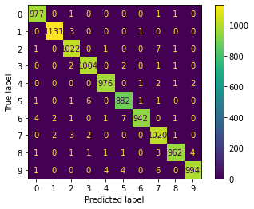

# Model Card

## Model Details

The model takes 28 x 28 greyscale images as inputs, with pixels normalised between [0,1]

The model is a Convolutional Nueral Network with 2 convolutional layers, max pooling, and drop out. 

|Layer (type) | Output Shape | Param |
| --- | --- | --- |
|conv2d (Conv2D) | (None, 26, 26, 32) | 320 |
| max_pooling2d (MaxPooling2D) | (None, 13, 13, 32) | 0 |                    
| conv2d_1 (Conv2D) | (None, 11, 11, 64) | 18496 |                                                          
| max_pooling2d_1 (MaxPooling2D | (None, 5, 5, 64) | 0 |                                           
| flatten (Flatten) | (None, 1600) | 0 |
| dropout (Dropout) | (None, 1600) | 0 |  
| dense (Dense) | (None, 10) | 16010 |

* Total params: 34,826
* Trainable params: 34,826
* Non-trainable params: 0
* Loss Function: Categorical Crossentropy
* Optimiser: Adam
* Epochs: 15
* Batch Size: 128

## Intended Use

The models intened use is for greyscale handwritten digits recognitions. Developed for zip code recognition in the postal service.

Intended use cases are any handwritten digit task.

Use cases out of scope include: alphabetic digit recognition and RGB digit recognition. 

## Factors

Image and handwritting quality may affect the performance of the model.

## Metrics

This is a classification model which uses Categorical Crossentropy as the loss function and Accuracy as the evaluation metric. 

## Evaluation & Training Data

Both evaluation and training data is from the MNIST grayscale images of the 10 digits created by Yann LeCun and Corinna Cortes. There are 60,000 training images and 10,000 testing. Of the 60,000 training images, 10% (6,000) are used as a held out validation set. 

## Quantitative Analyses

* Test loss: 0.02714177593588829
* Test accuracy: 0.9909999966621399

The following figure shows the confusion matrix for the model on the test data. We see no obvious bias towards misclassificaion of any class.

## Ethical Considerations

The model is simple and only used for handwritten digit recognition. We see not ethical implications of this model.

## Caveats and Recommendations